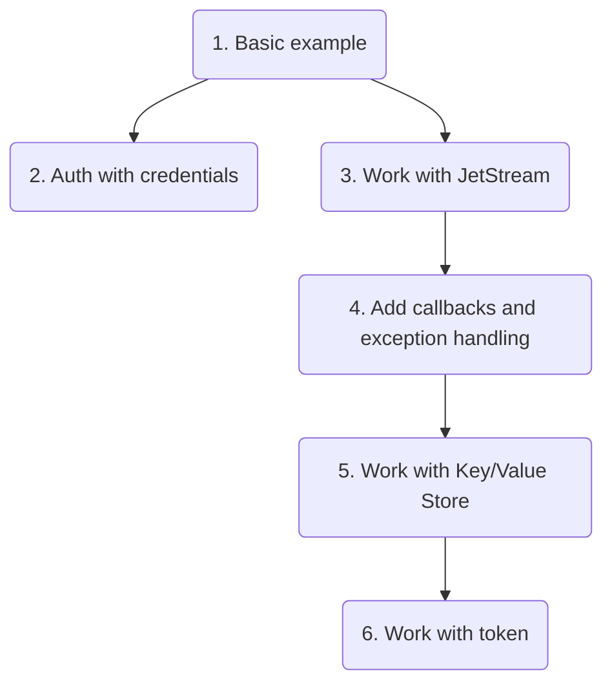

### Эксперименты с NATS

Небольшие практические примеры работы с системой сообщений [NATS](https://nats.io/). Все примеры исходного кода идут попарно, публикатор + подписчик.  

Перед началом работы необходимо [установить](https://nats.io/download/) и запустить сервер NATS:
```
REM Windows:
nats-server.exe -js REM Start NATS Server with JetStream
nats account info REM Check JetStream status
```
```
# Linux:
sudo nats-server -js # Start NATS Server with JetStream
nats account info # Check JetStream status
```

Также необходимо установить пакет _nats-py_:
```
pip install nats-py
```

Всего в этом репозитарии 6 примеров работы с NATS, описанных ниже.


1. Простейший пример.  
Строку подключения
```
nats_connector = await nats.connect(servers=["nats://localhost:4222"],
                                        name="NATS simple example publisher",
                                        connect_timeout=10,
                                        ping_interval=20,
                                        max_outstanding_pings=6,
                                        allow_reconnect=True,
                                        dont_randomize=False,
                                        reconnect_time_wait=5,
                                        no_echo=False)
```
в пределе можно сократить до
```
nats_connector = await nats.connect("nats://localhost:4222")
```
  
2. Авторизация на сервере при помощи файла сертификата ([credentials](https://docs.nats.io/using-nats/developer/connecting/creds)).

3. Пример работы с [JetStream](https://docs.nats.io/nats-concepts/jetstream), буферным хранилищем, позволяющим хранить непрочитанные сообщения на диске или в оперативной памяти.

4. Добавляем обработку исключений и функции обратного вызова.

5. Пример работы с [Key/Value Store](https://docs.nats.io/using-nats/developer/develop_jetstream/kv), надстройки над JetStream, позволяющей организовать более упорядоченное хранение информации.

6. Key/Value Store + авторизация по [токену](https://docs.nats.io/running-a-nats-service/configuration/securing_nats/auth_intro/tokens).
